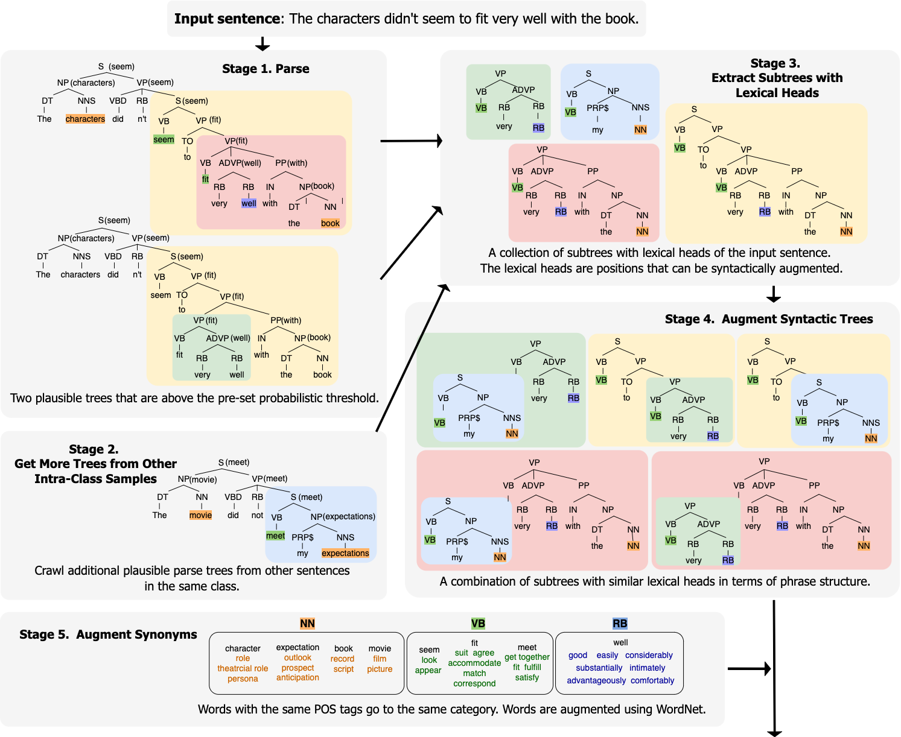
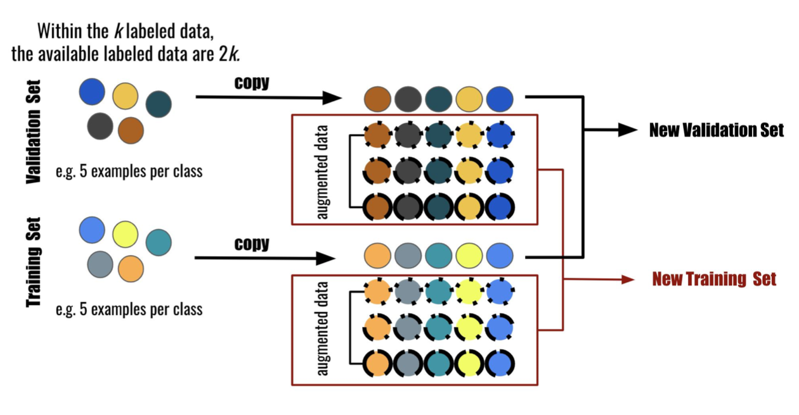

# ALP: Data **A**ugmentation using **L**exicalized **P**CFGs for Few-Shot Text Classification

This repository is for the paper: _Data Augmentation using Lexicalized PCFGs for Few-Shot Text Classification, AAAI 2022_.

To run the ALP method with semi-supervised learning, run **run_alp_st.py**. It augments given data using ALP and trains a classic self-training classifier to test the classification performance. You can run **the aug_alp.py** to solely use the ALP method for different purposes than our baseline semi-supervised learning method, classic self-training.

In this paper, we introduced data augmentation method and splitting schemes of training and validation sets to perform well in low-resource settings:

### Overview of ALP Method

### Overview of AugTrain-Train Method

